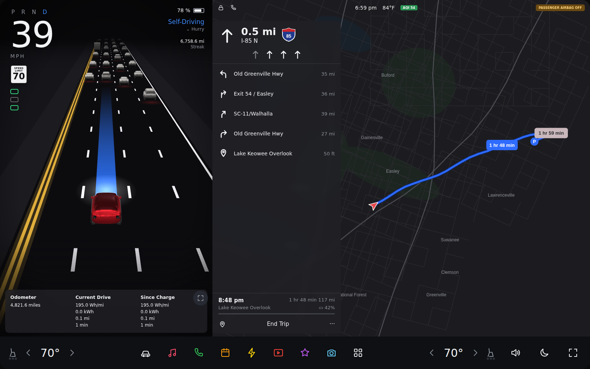
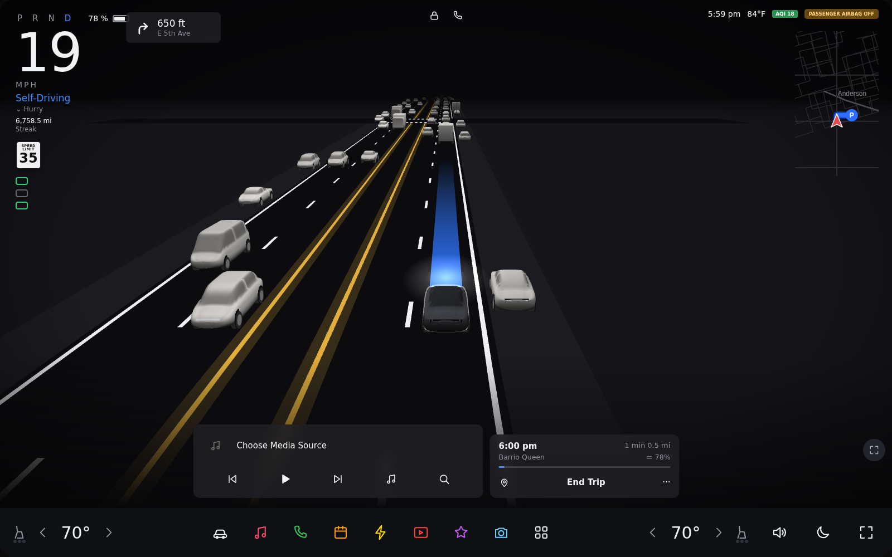
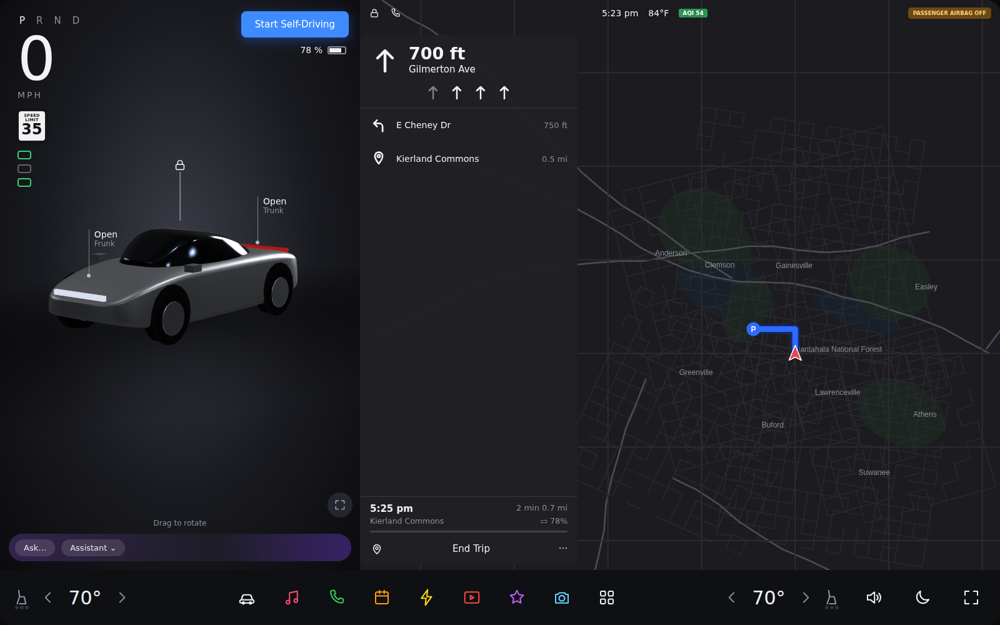
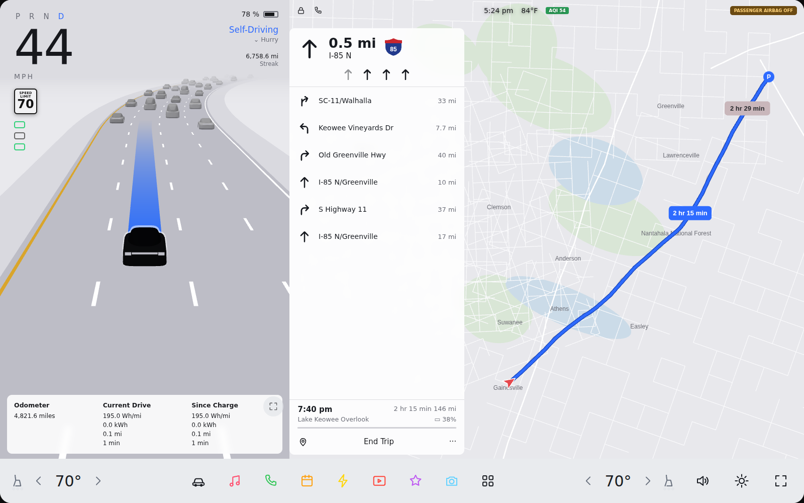

# Tesla Screen Sim

A touchscreen simulator of the Tesla in-car UI, built for a Windows 11 touch PC (e.g. Surface Studio) and
designed to sit on a desk and play a convincing **Self-Driving (FSD) drive** on its own. It is an independent,
unofficial look-alike: all icons, car models and artwork are original and procedurally generated. No Tesla
software or assets are used.

<p>
 
 
</p>

## Run it

**Windows 11 / macOS** — install Node.js LTS and Git, then in this folder:

```
npm install
npm start          # windowed
npm run kiosk      # fullscreen, screen kept awake: ideal for a desk display
```

`F11` toggles fullscreen (or tap the fullscreen icon at the right of the dock). `Esc` leaves fullscreen.
Build a double-clickable app with `npm run dist`.

> `npm install` pulls the **castLabs Electron** build (normal Electron + Widevine DRM). That is what lets
> Netflix / Disney+ / Prime etc. play inside Theater. Plain Electron cannot play DRM video.

## The drive display

The home screen is a live 3D Self-Driving visualisation, modelled on the real screen:

* **Parked view** — your car in 3/4 view in the selected paint, with *Open Frunk / Open Trunk* callouts, lock,
  *Start Self-Driving*, and a route preview. Drag to rotate.
* **Split layout (highway)** — road visualisation on the left (PRND, speed, speed-limit sign, *Self-Driving*,
  odometer / current drive / since charge) and the navigation panel on the right (next turn, lane guidance,
  upcoming maneuvers, ETA, *End Trip*, route map with time bubbles).
* **Full layout (city)** — full-width visualisation with nav chip, mini-map, media card and trip card.
  Tap the mini-map for the split layout, or the corner button to go full.
* **Your car** — the car being driven is drawn in the paint you pick and the model you pick: Model 3, Model Y,
  Model S, Model X, or the faceted Cybertruck, with a glass roof, mirrors, light bars and glossy reflections.
  Other traffic is matte grey, like the real display.
* **Traffic** — NPC cars follow cars ahead, change lanes with turn signals, overtake; in the city the ego stops
  at red lights and crosswalks, with cross traffic, pedestrians and parked cars. The blue planned path bends
  into lane changes.
* **Unattended loop** — city → highway → city until arrival → parked → repeat. Turn it off in
  *Controls → Simulator → Auto-run Self-Driving demo*.
* **Light / Dark / Auto** theme (moon/sun button on the dock). Graphics quality is under *Controls → Simulator*
  (Low / Balanced / High) if an older GPU struggles.

Tap **P/R/N/D** to control it: **D** starts a drive, **P** (or *End Trip*) pulls over and parks.

## Everything else

| Area | What works |
|---|---|
| Vehicles | Model 3, Model Y, Model S, Model X, Cybertruck: screen size/aspect, body type, paint colour, wheels. Add more in `src/js/models.js`. |
| Theater | Netflix, Disney+, YouTube, Hulu, Max, Prime Video, Apple TV+, Paramount+, Peacock, Twitch, Tubi, Plex, Crunchyroll, Vimeo in an embedded browser. Park-only, like the car; logins persist. |
| Media | Streaming music sites keep playing in the background; local audio files; mini player. |
| Climate | Dual-zone temps, fan, A/C, defrost, seat/wheel heat, Dog / Camp / Keep-climate-on. |
| Controls | Quick controls, Pedals & Steering, Charging, Autopilot, Locks, Lights, Display, Trips, Safety, Service, Software, Wi-Fi/Bluetooth, Simulator. |
| Apps | Phone, Calendar, Energy, Camera (uses the PC webcam), Web browser, Toybox (Snake, 2048, Sketchpad, Boombox, fireplace, light show). |

## Honest limits

* It simulates; nothing talks to a real vehicle. The Self-Driving scene is scripted traffic, not perception of a
  real road, and the 3D cars are original low-poly models, not Tesla's renders. It aims to be a close look-alike,
  not pixel-identical.
* The map is a stylised offline map (no internet needed); routes, street names and times are generated.
* Streaming quality depends on Widevine in the castLabs build. Netflix and some others check for VMP-signed
  builds and may cap resolution or refuse playback; castLabs offers a free signing service (EVS).
* Spec numbers (range, 0-60, screen size) are approximate.

## Project layout

```
main.js              Electron main process (window, fullscreen, Widevine, keep-awake)
preload.js           safe bridge to the renderer
src/index.html       shell (import map for three.js)
src/css/app.css      themes + shared widgets        src/css/drive.css  drive display
src/js/app.js        dock, apps, scaling, boot
src/js/drive/        world.js (road + traffic + lights sim), scene.js (three.js renderer), models3d.js, ego.js (detailed hero car),
                     hud.js (DOM overlays), director.js (trip loop), trip.js, fakemap.js, sound.js
src/js/apps/*        Theater, Media, Toybox, Phone, Calendar, Energy, Camera
reference/           frames from the screen recordings used to match the look
docs/screens/        screenshots
```
